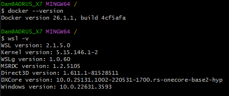
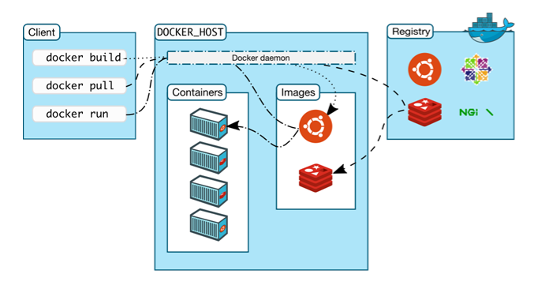
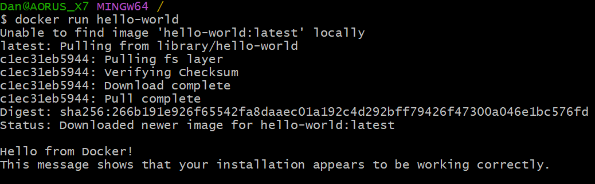

# Docker

## Installation

1. [Click here](https://docs.docker.com/desktop/install/windows-install/) for official installation guide
2. Ensure it's running by checking version



## How it works




- `docker build` builds an image using a file we create called a dockerfile which is like instructions. 
- When we build an image it we include everything it needs to run into one package. Almost like a template.
- `docker run` runs our image or any image from online (thousands available)
- When we run an image we create a container which is a running environment based off the image.
- We can create multiple containers from one image
- `docker pull` pulls an image from online.
- We can pull the images from dockerhub which is like a Online repository for images
- If we dont have the image when we use `docker run` it will try to pull it from dockerhub
- For example:

Run pulls the image




# Task - create nginx container and change the default html file

## Option 1 - 
### Modifying the container, commiting it to new image and pushing to dockerhub

### Commits and pushes 

To commit a Docker container, make changes to it, and push the updated image to Docker Hub, you can follow these steps:

### Prerequisites:
1. Ensure Docker is installed and running on your machine.
2. You have a Docker Hub account and are logged in using `docker login`.

### Steps:

1. **Run the Container:**
   Start a Docker container from an image.
   ```bash
   docker run -it --name my_container my_image:latest
   ```

2. **Commit the Container to an Image:**
   Commit the running container to a new image.
   ```bash
   docker commit my_container my_username/my_repository:initial
   ```

3. **Push the Initial Image to Docker Hub:**
   Push the newly committed image to your Docker Hub repository.
   ```bash
   docker push my_username/my_repository:initial
   ```

4. **Stop the Container:**
   Stop the container if it is still running.
   ```bash
   docker stop my_container
   ```

5. **Copy the File to the Container:**
   Restart the container in the background and copy the file.
   ```bash
   docker start my_container
   docker cp example.txt my_container:/app/
   ```

6. **Commit the Changes:**
   Commit the container with the added file to a new image version.
   ```bash
   docker commit my_container my_username/my_repository:updated
   ```

7. **Push the Updated Image to Docker Hub:**
   Push the newly updated image to your Docker Hub repository.
   ```bash
   docker push my_username/my_repository:updated
   ```

8. **Run a container from the image**
   Run it on port 80 using `-p` and run it in the background with `-d`
   ```bash
   docker run -p 80:80 -d dahm641/tech258-nginx:latest
   ```


docker
### Summary:
- **Run a container** from your image.
- **Commit the container** to a new image and **push it** to Docker Hub.
- **Make changes** to the container, such as copying files.
- **Commit the updated container** to a new image version and **push it** to Docker Hub.
- **Run container** 

Ensure you replace `my_username`, `my_repository`, `my_image`, `my_container`, and `example.txt` with your actual Docker Hub username, repository name, image name, container name, and file name, respectively.


## Option 2
### Building a new image from a base image and then pushing the new image

- Need a file called a dockerfile (no extensions)
- This instructs docker on what base image to use and what instructions it needs to follow to build the image
- This could be installing dependencies or copying files

Here’s how you can write a `Dockerfile` that copies the content of your local directory into the specified working directory (`/usr/share/nginx/html`) of an Nginx container, build the image, and push it to Docker Hub under the repository `dahm641/tech258-nginx`.

### Dockerfile:

Create a file named `Dockerfile` in your project directory with the following content:

```Dockerfile
# dockerfile to build image/microservice to host static website

# which image to use

# Use the official Nginx image as a base
FROM nginx:latest

# who is building it
LABEL MAINTAINER=DANIAL646@HOTMAIL.CO.UK

# Set the working directory in the container
WORKDIR /usr/share/nginx/html

# Copy the contents of the local directory to the container
COPY . .

# for one file can use COPY index.html /usr/share/nginx/html/

# which ports to expose/enable
EXPOSE 80

# launch server using CMD
# for nginx dont need as it has it in the base image but good practise to include
CMD ["nginx", "-g", "daemon off;"]

# create where index.html is located
```

### Building and Pushing the Docker Image:

1. **Navigate to the project directory**:
   Open a terminal and change to the directory containing your `Dockerfile` and the content you want to copy:

   ```bash
   cd path/to/your/project
   ```

2. **Build the Docker image**:
   Build the Docker image and tag it with your Docker Hub username and repository name:

   ```bash
   docker build -t dahm641/tech258-nginx:latest .
   ```

3. **Log in to Docker Hub**:
   Ensure you are logged in to Docker Hub:

   ```bash
   docker login
   ```

   You will be prompted to enter your Docker Hub username and password.

4. **Push the Docker image to Docker Hub**:
   Push the newly built image to your Docker Hub repository:

   ```bash
   docker push dahm641/tech258-nginx:latest
   ```


5. **Run a container from the image**
   Run it on port 80 using `-p` and run it in the background with `-d`
   ```bash
   docker run -p 80:80 -d dahm641/tech258-nginx:latest
   ```


### Summary:
- **Create a `Dockerfile`** that copies the contents of the local directory to the Nginx container's working directory.
- **Build the Docker image** using `docker build`.
- **Log in to Docker Hub**.
- **Push the image** to Docker Hub using `docker push`.
- **Run container**

By following these steps, you will have a Docker image that contains your website files in the appropriate Nginx directory and have it uploaded to Docker Hub under `dahm641/tech258-nginx`.

To remove Docker images from your local system, you can use the `docker rmi` command. Below are the steps and various methods to remove Docker images:

## Steps to Remove Docker Images and containers:
### Images

1. **List Docker Images:**
   First, list all the Docker images available on your local machine.
   ```bash
   docker images
   ```

   Example output:
   ```plaintext
   REPOSITORY          TAG                 IMAGE ID            CREATED             SIZE
   my_username/my_app  latest              d1e7f38bc6b8        2 days ago          123MB
   my_username/my_app  initial             a1b2c3d4e5f6        3 days ago          120MB
   <none>              <none>              b6c7d8e9f0a1        4 days ago          115MB
   ```

2. **Remove a Specific Image:**
   To remove a specific Docker image, use the `docker rmi` command followed by the image ID or the repository and tag name.

   - By image ID:
     ```bash
     docker rmi d1e7f38bc6b8
     ```

   - By repository and tag name:
     ```bash
     docker rmi my_username/my_app:latest
     ```

3. **Remove Multiple Images:**
   You can remove multiple Docker images by specifying their IDs or repository:tag names separated by spaces.
   ```bash
   docker rmi d1e7f38bc6b8 a1b2c3d4e5f6
   ```

4. **Remove All Unused Images:**
   To remove all images that are not currently being used by any container (dangling images), use the `docker image prune` command.
   ```bash
   docker image prune
   ```

### Containers

1. **List containers:**
    `docker ps` command for running containers and `docker ps -a` for all containers
   ```bash
   docker ps
   docker ps -a
   ```
2. **Remove containers:**
    `docker rm containerID` command for removing containers and add `-f` to force remove incase thy are running.
   ```bash
   docker rm containerID
   docker rm -f containerID
   ```
  

### Summary:
- Use `docker rmi <image_id>` or `docker rmi <repository>:<tag>` to remove specific images.
- Use `docker image prune` to remove all unused images.
- Use `docker ps` to show running containers
- Use `docker rm containerID` to remove stopped containers
- Use `docker ps -a` to show all containers
- Use `docker rm containerID -f` to force remove containers even if they are running

# Task - create the app as a microservice/container

## Use build image method

### App files
1. Copy the app files to a new directory or use gitbash to navigate to the app directory
2. From here set up your dockerfile

### dockerfile

```bash
# create a script to build an image/microservice of nodejs app
# containerise node app
# build the image
# test image on port 3000 locally
# if works push to dockerhub and share image


# Use the official Nginx image as a base
FROM node:latest

# who is building it
LABEL MAINTAINER=DANIAL646@HOTMAIL.CO.UK

# start at root
WORKDIR /usr/src/

# copy the app

COPY . .

# move to working directory

WORKDIR /usr/src/app

# Install NPM

RUN npm install

# Install PM2 (Dont need pm2 but included anyways)

RUN npm install -g pm2 

# port
EXPOSE 3000

# launch
CMD ["pm2-runtime", "start", "app.js"]
```

### Build the image and run

- `docker build -t dahm641/nodejs-app:latest .`
- Run the container from the image 
- `docker run -d -p 3000:3000 dahm641/nodejs-app:latest`