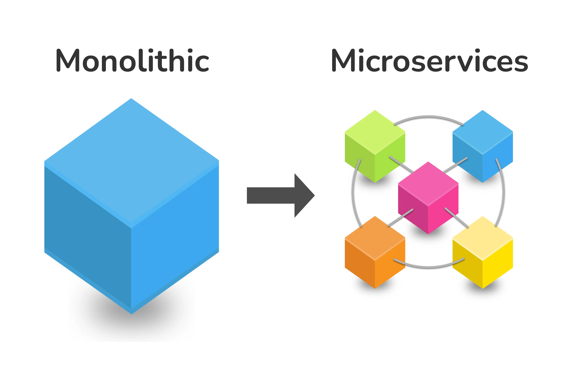
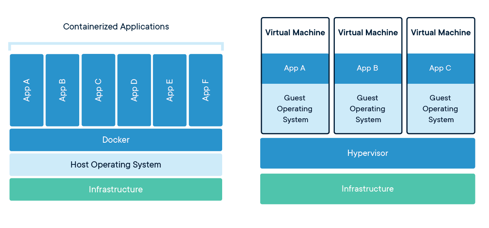

# Microservices architecture with Docker and K8

## Docker

### What is it

Docker is one of the most popular tools for creating, deploying, and managing containers. It allows developers to build images (snapshots of a container) and run containers consistently across different environments.
### What is a microservice

Microservices is a design style where an application is composed of small independent services that are:

- Independently deployable
- Loosely coupled
- Services are typically organized around business capabilities. Each service is often owned by a single, small team.
- Each microservice is responsible for a specific functionality and can be developed, deployed, and scaled independently.
- One common example is a User Authentication Service. This service is responsible for managing user accounts, authentication, and authorization.  

- Traditionally, in a **monolithic architecture** the entire app would be deployed as one unit where everything is included in one giant architecture and codebase.
- This is good for fixed requirements but isn't good for scaling and ever-changing needs
- Small changes would require redeploying the whole app
### What is a Container
- Containers are packages of software that contain all of the necessary elements so the application runs quickly and reliably from one computing environment to another.

### How do they work

- Use the host kernel to isolate resources for containers.
- By sharing the host kernel and operating system can avoid virtualisation
- containers are considered a more lightweight solution – they require fewer resources without compromising on performance.

### Container vs VM/Virtualisation

- **Containers:**
  - Share the host OS kernel.
  - Lightweight and fast to start.
  - Use less memory and storage.
- **Virtual Machines (VMs):**
  - Include a full guest OS, leading to higher resource usage.
  - Slower to start due to OS boot-up.
  - Heavier in terms of memory and storage.
  - Virtualization involves creating multiple virtual machines (VMs) on a single physical server, with each VM running its own operating system and applications, isolated from one another. 
  - Containerization, on the other hand, runs multiple containers on the same OS kernel, with each container sharing the OS but running its own isolated application and dependencies. 
  - Containers are more lightweight and efficient compared to VMs, as they don't require a full OS for each instance, leading to faster startup times and lower resource usage.

what is the os kernel
ChatGPT
The OS kernel is the core component of an operating system that manages system resources and communication between hardware and software. It acts as an intermediary, facilitating essential functions like process management, memory management, and device control. The kernel ensures that different programs and users can operate simultaneously and efficiently on a computer.

### DevEnv
A development environment (dev env) in Docker is a setup where developers use Docker containers to create a consistent and isolated environment for writing, testing, and debugging code. This helps ensure that the development environment closely mirrors the production environment, reducing the "it works on my machine" problem

### Container lifecycle
1. image creation
2. container creation from image
3. container start
4. container running
5. container pause
6. container stop/start
7. container removal

### Why its used
### Building docker images
- Creaete a file called dockerfiel with no extension
- Use FROM and chose a base image as a template and how to build on top of it
### Dockerhub
- Dockerhub is an online repository that hosts images created by you, others and official company images that are available to use.
- Docker Hub is an online repository for storing and sharing Docker images. It provides a vast library of public images and allows users to host their own private images. Docker Hub simplifies the distribution and management of containerized applications with features like automated builds and image versioning.

## Kubernetes (K8)
### What is it
### Why its used
### Orchestration with K8